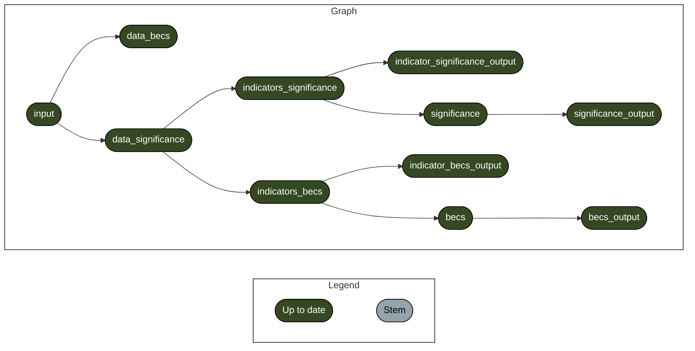

<!-- README.md is generated from README.Rmd. Please edit that file -->

<!-- badges: start -->

[](https://www.tidyverse.org/lifecycle/#experimental)
<!-- badges: end -->

> \[!IMPORTANT\]  
> This pipelines requires the
> [`proximity-indicators`](https://github.com/mapme-initiative/mapme.biodiversity/tree/proximity-indicators)
> branch of `mapme.biodiversity` to be installed.

# disclosure-report

This repository contains code that mimics [IBAT’s disclosure preparation
report](https://www.ibat-alliance.org/sample-downloads) as a
reproducible [`{targets}`](https://books.ropensci.org/targets/)
pipeline.

While we do not produce PDF reports here, we go beyond IBAT’s
functionality in the sense that we calculate significance scores for
entire portfolios using
[`mapme.biodiversity`](https://github.com/mapme-initiative/mapme.biodiversity).

The required inputs are:

- `data/locations.json`: An GDAL-readable input file with vector
  geometries representing project locations with attributes available to
  specify the area of influence (see below).

The key part of this pipeline is that you can customize the area of
influence (or buffer zones) to be used for your locations. For this, you
need to change the values of the variables `code_column` and `aoi_size`
you can find in the header of [`_targets.R`](_targets.R). `code_column`
identifies the column in the input data to be linked via the `code`
column in `aoi_size` to an associated buffer size. Note, that codes not
present in `aoi_size` will be encoded with the `default` value.

The pipeline then calculates the respective indicators within the area
of influence for each location. These are:

- proximity to protected areas
- proximity to key biodiversity areas
- number of threatened species
- maximum value of STAR layers threat abatement and restoration

These are individually scored to their biodiversity significance in
accordance to the IBAT workflow. A site also receives a total
biodiversity significance score equal to the highest score of the
individual components (none, low, medium, and high).

The pipeline also computes the
[BECS](https://www.thebiodiversityconsultancy.com/fileadmin/uploads/tbc/Documents/Resources/ARTICULATING_AND_ASSESSING_BIODIVERSITY_IMPACT-BIAF.pdf)
indicator for each region. The BECS result file contains the indicator
itself, as well as the numeric variables that make up the indicator for
better interpretability.

The codes are structured in the following way:

- [`inputs.R`](R/inputs.R): read inputs and calculate area of influence
- [`mapme.R`](R/mapme.R): calculate the required indicators
- [`significance.R`](R/significance.R): calculation of significance
  scores
- [`becs.R`](R/becs.R): calculation of BECS scores

To run the pipeline, adjust [`_targets.R`](_targets.R) to point towards
your input file and run the following from a shell:

``` shell
$ dvc pull
$ Rscript -e 'targets::tar_make()'
```

Below you can find the visualisation of the pipeline’s targets:

- The library is already synchronized with the lockfile.


