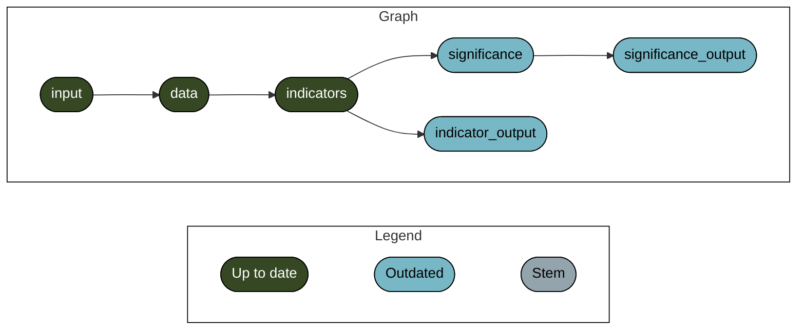

<!-- README.md is generated from README.Rmd. Please edit that file -->

# disclosure-report

<!-- badges: start -->

[](https://www.tidyverse.org/lifecycle/#experimental)
<!-- badges: end -->

Skipping install of ‘mapme.biodiversity’ from a github remote, the SHA1
(5ad979a8) has not changed since last install. Use `force = TRUE` to
force installation



``` shell
$ Rscript -e 'targets::tar_make()'
```
